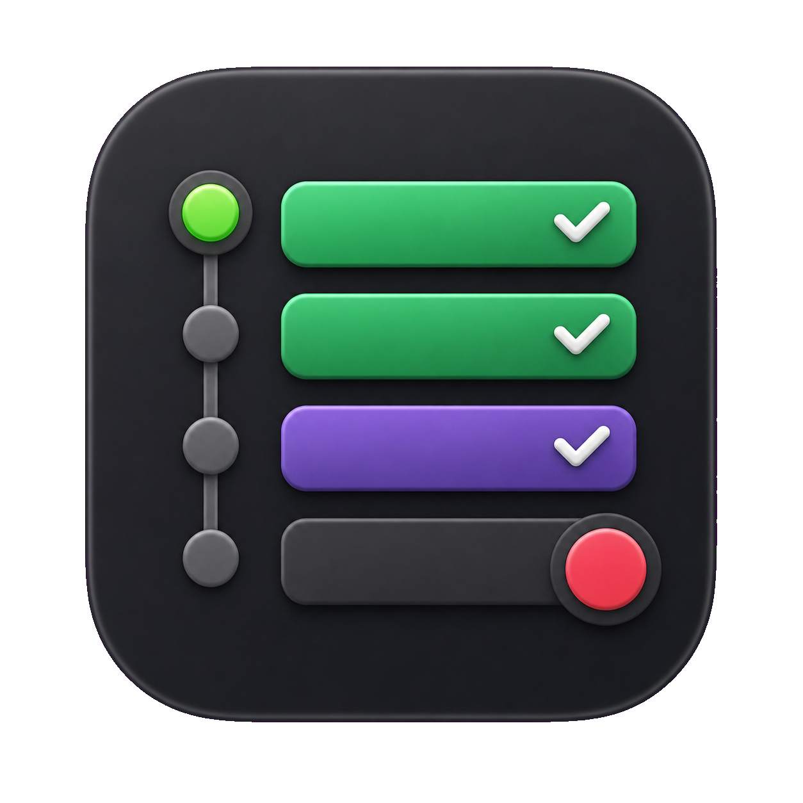
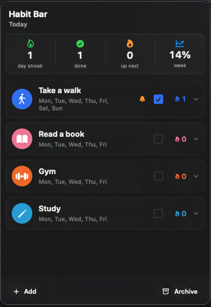

# HabitBar

<p align="center">
  
</p>

HabitBar is a native macOS habit tracker built around a menu bar popover. It is
designed for fast daily check-ins: open the menu bar item, review today's habits,
log progress, inspect recent history, and make small edits without switching to a
full dashboard.

## Sample Screen

<p align="center">
  
</p>

## Features

- Menu-bar-first macOS app.
- Create, edit, archive, restore, and delete habits.
- Configure habit name, icon, accent color, tracking days, and local reminders.
- Toggle completion for today and visible history dates.
- Review current streak, best streak, weekly completion, and month history.
- Navigate month history up to the current month.
- Use system, light, or dark theme mode.

## Requirements

- macOS 14 or newer.
- Swift 5.10 or newer.
- Xcode command line tools.

## Build And Run

Build all SwiftPM targets:

```sh
swift build
```

Build a local app bundle and launch it:

```sh
./script/build_and_run.sh
```

Build and run the release bundle:

```sh
./script/build_and_run.sh --release
```

Verify the release bundle starts:

```sh
./script/build_and_run.sh --verify-release
```

The run script creates `dist/HabitBar.app`, copies the app icon into the bundle,
and stops any existing `HabitBar` process before launching.

## Landing Page

The static GitHub Pages landing page lives at `docs/index.html`, with page
assets under `docs/assets/`. It has no build step and can be hosted from the
repository `docs/` folder.

## Tests

Run unit tests:

```sh
swift test
```

Run unit tests plus the UI smoke flow:

```sh
./script/run_tests.sh
```

Run only the UI smoke flow:

```sh
./script/build_and_run.sh --ui-smoke
```

The smoke flow covers launch, popover detection, completion toggling, adding,
editing, deleting, archiving, and restoring habits.

## Project Layout

- `Sources/HabitBar/`: macOS app, SwiftUI views, services, resources.
- `Sources/HabitBarCore/`: domain models, rule engine, notification planning,
  and store contracts.
- `Sources/HabitBarUITestRunner/`: local UI smoke-test executable.
- `Tests/HabitBarCoreTests/`: unit tests for core behavior.
- `docs/`: product, architecture, habit rules, UI design, and development notes.
- `script/`: build, run, and verification scripts.

## Development Notes

Keep habit rule logic in `HabitBarCore`. Keep macOS platform integrations in
`HabitBar`, behind focused services where possible. Add unit tests for rule,
persistence, and notification-planning changes before relying on visual behavior.

More detail:

- [Product scope](docs/product.md)
- [Architecture](docs/architecture.md)
- [Habit rules](docs/habit-rules.md)
- [Development commands](docs/development.md)
